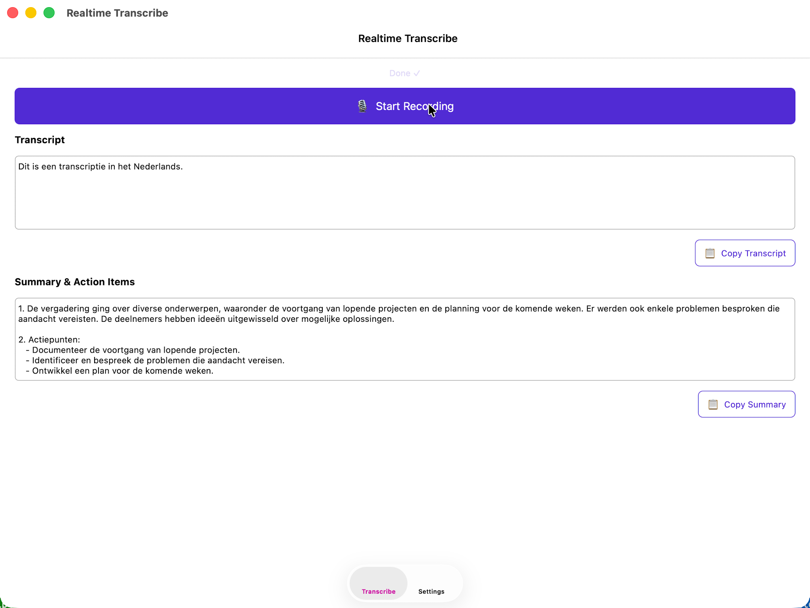

# Realtime Transcribe

A .NET MAUI macOS app that records meeting audio, transcribes it with **Azure AI Foundry Whisper**, and generates a concise summary with action items using **Azure OpenAI GPT-4o**.

Supports Dutch 🇳🇱 and English 🇬🇧 automatically (Whisper auto-detects language; the summary prompt responds in the same language).



---

## Table of Contents

- [Features](#features)
- [Documentation](#documentation)
- [Requirements](#requirements)
- [Quick start](#quick-start)
- [Project structure](#project-structure)
- [License](#license)

---

## Features

| Feature | Details |
|---|---|
| 🎙 Recording | Microphone capture (16 kHz mono WAV) |
| 🔊 Full-audio capture | Optional BlackHole loopback for Teams/Zoom |
| 📝 Transcription | Azure AI Foundry Whisper large-v3 |
| 👥 Speaker recognition | GPT-based diarization; labels turns as Speaker 1, 2, … |
| ⚡ Realtime updates | Transcript updated every 30 s during recording |
| 🤖 Summary | GPT-4o-mini; concise summary + bullet action items, rendered as Markdown |
| 🌍 Languages | Dutch & English auto-detected |
| ⚙️ Settings UI | Endpoint / API key configurable in-app |
| 📋 Copy buttons | One-tap copy of transcript, speaker transcript, or summary |
| 🔡 Text scaling | A− / A+ buttons adjust text size (10–28 pt); persisted across restarts |

---

## Documentation

- [Installation](docs/installation.md) — download the app, bypass macOS Gatekeeper, build from source
- [BlackHole & macOS Audio Setup](docs/blackhole-setup.md) — capture system audio alongside the microphone
- [Azure AI Foundry Setup](docs/azure-setup.md) — create a project, deploy models, get credentials
- [Configuration](docs/configuration.md) — Settings UI, appsettings.json, User Secrets, passwordless auth

---

## Requirements

- macOS 14 Sonoma or later
- .NET 10 SDK with the **MAUI workload** (`dotnet workload install maui`)
- An Azure subscription with a Whisper and a GPT deployment — see [Azure AI Foundry Setup](docs/azure-setup.md)

---

## Quick start

1. **Download** the app from [Releases](https://github.com/Jandev/realtime-transcribe/releases) and allow it to run — see [Installation](docs/installation.md).
2. **Configure Azure credentials** in the Settings tab or `appsettings.json` — see [Configuration](docs/configuration.md).
3. *(Optional)* **Set up BlackHole** to capture system audio — see [BlackHole & macOS Audio Setup](docs/blackhole-setup.md).
4. Press **Start Recording**. Select the recording device from the **Devices** tab if needed.
5. Press **Stop** to end the recording. The app transcribes any remaining audio and generates a summary.

---

## Project structure

```
src/RealtimeTranscribe/
├── MauiProgram.cs              DI setup, configuration loading
├── App.xaml / .cs              Application entry point
├── AppShell.xaml / .cs         Tab navigation
├── MainPage.xaml / .cs         Main recording UI
├── SettingsPage.xaml / .cs     Azure configuration UI
├── ViewModels/
│   ├── MainViewModel.cs        Record/Stop/Copy logic
│   └── SettingsViewModel.cs    Settings persistence logic
├── Services/
│   └── AudioService.cs         Plugin.Maui.Audio wrapper
├── Platforms/MacCatalyst/
│   └── Info.plist              NSMicrophoneUsageDescription
└── Resources/

src/RealtimeTranscribe.Core/
├── Services/
│   ├── TranscriptionService.cs Azure Whisper + GPT integration
│   └── TranscriptionScheduler.cs 30-second audio chunking
└── Models/
    └── AzureOpenAISettings.cs  Strongly-typed config
```

---

## License

MIT – see [LICENSE](LICENSE).
