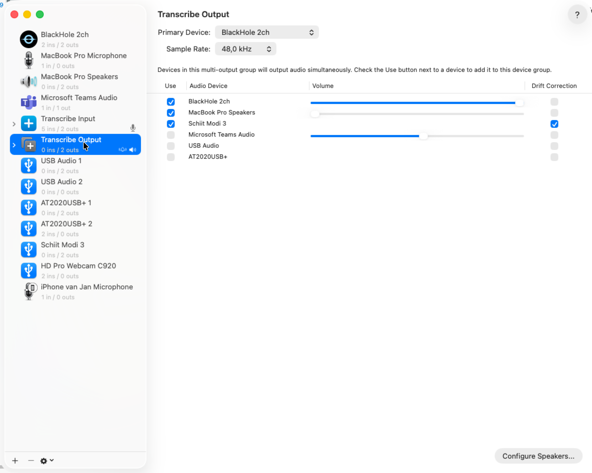
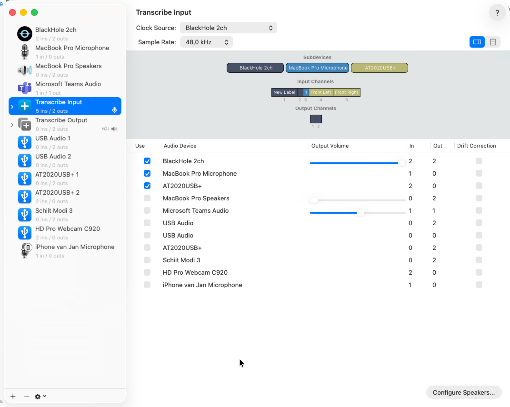
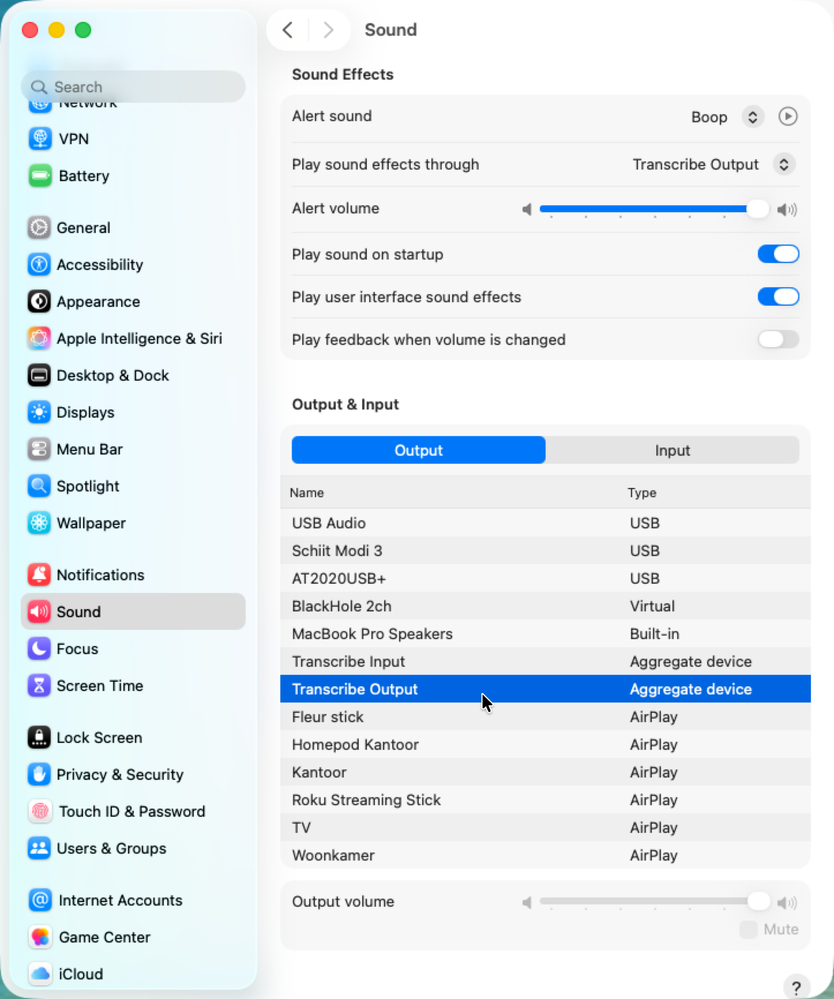
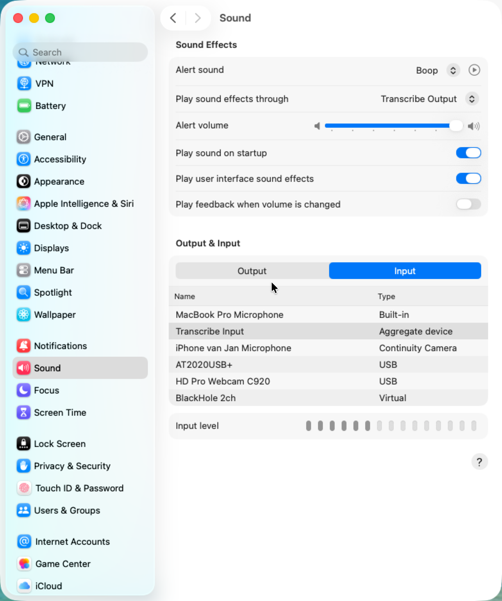

# BlackHole & macOS Audio Setup

Realtime Transcribe can capture **system audio** (anything that plays on your Mac, including audio from Teams, Zoom, browser tabs, music apps) in two ways:

1. **Built-in (recommended, macOS 14.2+):** select **"System Audio (all apps)"** at the top of the Input device list inside the app. This uses the CoreAudio Process Tap API and works with any output device — including AirPods and other Bluetooth headphones — with no extra setup. The first time you select it, macOS will prompt you to allow system-audio capture. See [System Audio Capture](system-audio-setup.md) for details and troubleshooting.
2. **BlackHole (fallback, older macOS or special routing needs):** the steps below describe the manual virtual-loopback setup that was required before the built-in option existed.

> **Tip:** If you only want to record your own microphone, just pick the built-in microphone (or another physical input device) in the app's Devices tab — neither the built-in System Audio entry nor BlackHole is needed.

---

[BlackHole](https://existential.audio/blackhole/) is a free virtual audio driver for macOS that routes system audio (e.g. from Teams or Zoom) into a recording device alongside your microphone.

## Table of Contents

- [Install BlackHole](#install-blackhole)
- [Create a Multi-Output Device](#create-a-multi-output-device)
- [Create an Aggregate Input Device](#create-an-aggregate-input-device)
- [Configure macOS Sound settings](#configure-macos-sound-settings)
- [Select the recording device in the app](#select-the-recording-device-in-the-app)
- [Bluetooth devices](#bluetooth-devices)
  - [AirPods Pro and other Bluetooth headphones (audio quality)](#airpods-pro-and-other-bluetooth-headphones-audio-quality)
  - [Capturing system audio through AirPods / Bluetooth output devices](#capturing-system-audio-through-airpods--bluetooth-output-devices)

---

## Install BlackHole

```bash
brew install blackhole-2ch
```

Or download the installer from https://existential.audio/blackhole/

---

## Create a Multi-Output Device

A Multi-Output Device sends audio to multiple outputs at once — your speakers *and* BlackHole — so you can still hear the call while it is being captured.

1. Open **Audio MIDI Setup** (`/Applications/Utilities/Audio MIDI Setup.app`).
2. Click **+** at the bottom-left → **Create Multi-Output Device**.
3. In the device list on the right, check both **BlackHole 2ch** and your speakers / headphones.
4. Double-click the device name and rename it (e.g. `Transcribe Output`).



---

## Create an Aggregate Input Device

An Aggregate Input Device combines multiple inputs into one — BlackHole (which receives system audio) *and* your microphone.

1. In **Audio MIDI Setup**, click **+** → **Create Aggregate Device**.
2. Check **BlackHole 2ch** and your built-in microphone (and any other microphone you want to use).
3. Set the **Clock Source** to **BlackHole 2ch**.
4. Double-click the device name and rename it (e.g. `Transcribe Input`).



---

## Configure macOS Sound settings

### Output

Set macOS to play audio through the Multi-Output Device so system audio is routed through BlackHole.

Open **System Settings → Sound** and on the **Output** tab select **Transcribe Output**.



### Input

On the **Input** tab select **Transcribe Input** so the app can capture both the microphone and system audio.



---

## Select the recording device in the app

The recording device can be selected inside the app on the **Devices** tab. Choose **Transcribe Input** (the aggregate device) to capture both your microphone and system audio simultaneously.

> **Tip:** If you only want to record your own microphone (no system audio), select the built-in microphone directly instead of the aggregate device.

---

## Bluetooth devices

### AirPods Pro and other Bluetooth headphones (audio quality)

When a recording starts, macOS activates the audio session in *PlayAndRecord* mode.
If the **AllowBluetooth** (Hands-Free Profile / HFP) option is also active, the OS
downgrades Bluetooth output devices — including AirPods Pro — from the high-quality
**A2DP** profile to the lower-quality **HFP/SCO** profile.  This is the "flat, phone-call
quality" audio change you hear when recording begins.

The app automatically avoids this downgrade: **AllowBluetooth (HFP) is only enabled when
the selected input device is itself a Bluetooth microphone.**  If you record from a
built-in microphone, a USB headset, or a virtual loopback device such as BlackHole, your
AirPods Pro (and any other Bluetooth headphones) will remain on the high-quality A2DP
profile throughout the recording.

> **Tip:** If you *do* select AirPods Pro as the input microphone, the OS will activate
> HFP — this is an OS-level requirement for bidirectional Bluetooth audio and cannot be
> avoided.  For the best combined input and output quality, use the built-in microphone
> (or an aggregate device with BlackHole) as the input and let AirPods stay on A2DP for
> output.

### Capturing system audio through AirPods / Bluetooth output devices

> **The easiest way is to use the built-in option:** select **"System Audio (all apps)"** at the top of the Input device list in the app's Devices tab. This works with AirPods and any other output device, requires no Audio MIDI Setup configuration, and avoids every Bluetooth-aggregate-device pitfall described below. It is available on macOS 14.2 and later.

If you are on an older macOS or need the BlackHole-based routing for another reason, Bluetooth devices — including AirPods Pro — cannot be used as a *loopback* input device themselves. They receive audio from the Mac but have no way to feed that audio back as a recording input. To capture system audio that plays through AirPods, you can still use **BlackHole**:

1. Create a **Multi-Output Device** in Audio MIDI Setup with both **BlackHole 2ch** and
   **AirPods Pro** checked (see [Create a Multi-Output Device](#create-a-multi-output-device)).
2. Set macOS **Sound → Output** to that Multi-Output Device.
3. Create an **Aggregate Input Device** that combines BlackHole 2ch with your microphone
   (see [Create an Aggregate Input Device](#create-an-aggregate-input-device)).
4. Select that aggregate device as the input in the app's **Devices** tab.

> **Important:** Do **not** include the AirPods themselves inside the aggregate input
> device.  macOS removes Bluetooth devices from an aggregate when they disconnect, which
> disrupts recording.  Route AirPods through the multi-output device for playback only,
> and capture audio via BlackHole in the aggregate input device.
